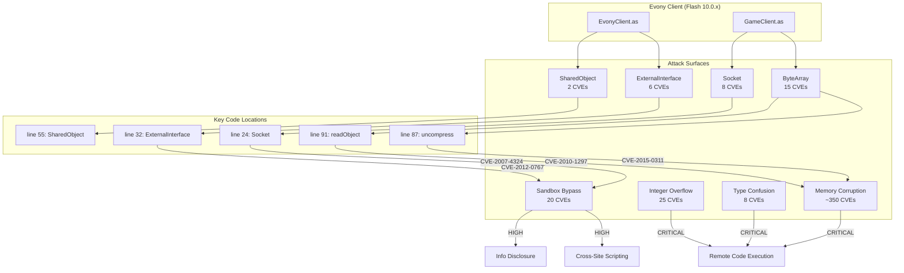
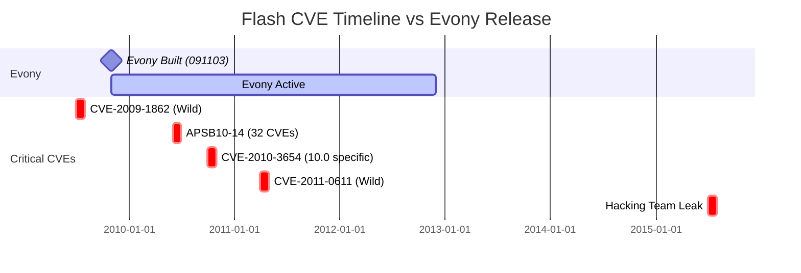
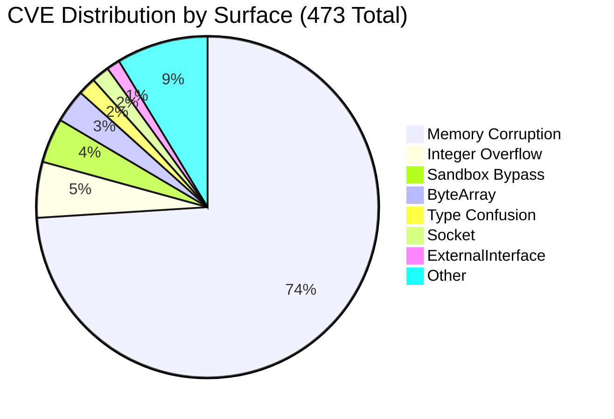
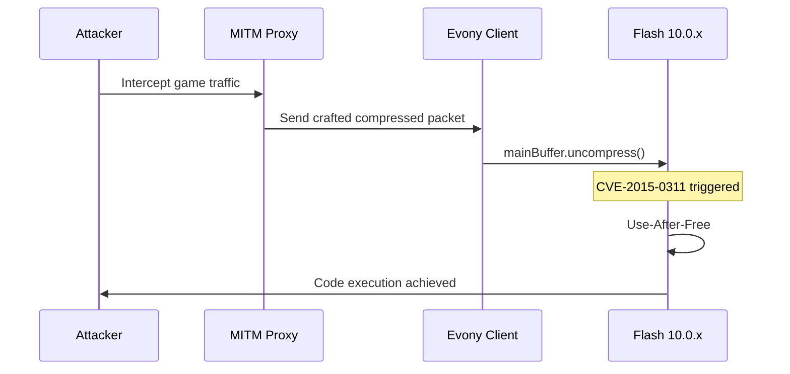

# Evony Flash CVE Attack Surface Map

```mermaid
graph TB
    subgraph "Evony Client (Flash 10.0.x)"
        EC[EvonyClient.as]
        GC[GameClient.as]
    end
    
    subgraph "Attack Surfaces"
        BA[ByteArray<br/>15 CVEs]
        SK[Socket<br/>8 CVEs]
        EI[ExternalInterface<br/>6 CVEs]
        SO[SharedObject<br/>2 CVEs]
        MEM[Memory Corruption<br/>~350 CVEs]
        IO[Integer Overflow<br/>25 CVEs]
        TC[Type Confusion<br/>8 CVEs]
        SB[Sandbox Bypass<br/>20 CVEs]
    end
    
    subgraph "Key Code Locations"
        L87[line 87: uncompress]
        L91[line 91: readObject]
        L24[line 24: Socket]
        L32[line 32: ExternalInterface]
        L55[line 55: SharedObject]
    end
    
    EC --> EI
    EC --> SO
    GC --> BA
    GC --> SK
    
    BA --> L87
    BA --> L91
    SK --> L24
    EI --> L32
    SO --> L55
    
    L87 --> |CVE-2015-0311| MEM
    L91 --> |CVE-2010-1297| MEM
    L24 --> |CVE-2007-4324| SB
    L32 --> |CVE-2012-0767| SB
    
    MEM --> |CRITICAL| RCE[Remote Code Execution]
    IO --> |CRITICAL| RCE
    TC --> |CRITICAL| RCE
    SB --> |HIGH| XSS[Cross-Site Scripting]
    SB --> |HIGH| INFO[Info Disclosure]
```

## Timeline: Evony vs Flash CVEs

```mermaid
gantt
    title Flash CVE Timeline vs Evony Release
    dateFormat  YYYY-MM
    section Evony
    Evony Built (091103)      :milestone, 2009-11, 0d
    Evony Active              :active, 2009-11, 2012-12
    
    section Critical CVEs
    CVE-2009-1862 (Wild)      :crit, 2009-07, 2009-08
    APSB10-14 (32 CVEs)       :crit, 2010-06, 2010-07
    CVE-2010-3654 (10.0 specific) :crit, 2010-10, 2010-11
    CVE-2011-0611 (Wild)      :crit, 2011-04, 2011-05
    Hacking Team Leak         :crit, 2015-07, 2015-08
```

## CVE Distribution by Attack Vector

```mermaid
pie title CVE Distribution by Surface (473 Total)
    "Memory Corruption" : 350
    "Integer Overflow" : 25
    "Sandbox Bypass" : 20
    "ByteArray" : 15
    "Type Confusion" : 8
    "Socket" : 8
    "ExternalInterface" : 6
    "Other" : 41
```

## Exploitation Chain Example

```mermaid
sequenceDiagram
    participant Attacker
    participant MITM as MITM Proxy
    participant Evony as Evony Client
    participant Flash as Flash 10.0.x
    
    Attacker->>MITM: Intercept game traffic
    MITM->>Evony: Send crafted compressed packet
    Evony->>Flash: mainBuffer.uncompress()
    Note over Flash: CVE-2015-0311 triggered
    Flash->>Flash: Use-After-Free
    Flash->>Attacker: Code execution achieved
```
